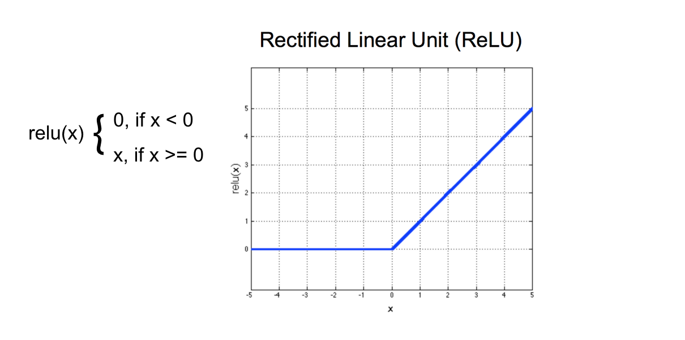

# Lesson 5: Convolutional Neural Networks

## Outline

## How Computers interpret images

## MLP Structure & Class Scores

## Loss & Optimization

## Defining a Network in Pytorch


### ReLu Activation Function

The purpose of an activation function is to scale the outputs of a layer so that they are a consistent, small value. Much like normalizing input values, this step ensures that our model trains efficiently!

A ReLu activation function stands for "rectified linear unit" and is one of the most commonly used activation functions for hidden layers. It is an activation function, simply defined as the positive part of the input, `x`. So, for an input image with any negative pixel values, this would turn all those values to `0`, black. You may hear this referred to as "clipping" the values to zero; meaning that is the lower bound.




### Cross-Entropy Loss

In the [PyTorch documentation](https://pytorch.org/docs/stable/nn.html#crossentropyloss) , you can see that the cross entropy loss function actually involves two steps:

* It first applies a softmax function to any output is sees
* Then applies [NLLLoss](https://pytorch.org/docs/stable/nn.html#nllloss); negative log likelihood loss

Then it returns the average loss over a batch of data. Since it applies a softmax function, we do not have to specify that in the `forward` function of our model definition, but we could do this another way.

#### Another approach

We could separate the softmax and NLLLoss steps.

* In the `forward` function of our model, we would explicitly apply a softmax activation function to the output, `x`.

```python
 ...
 ...
# a softmax layer to convert 10 outputs into a distribution of class probabilities
x = F.log_softmax(x, dim=1)

return x
```

* Then, when defining our loss criterion, we would apply NLLLoss

```python
# cross entropy loss combines softmax and nn.NLLLoss() in one single class
# here, we've separated them
criterion = nn.NLLLoss()
```

This separates the usual `criterion = nn.CrossEntropy()` into two steps: softmax and NLLLoss, and is a useful approach should you want the output of a model to be class probabilities rather than class scores.


