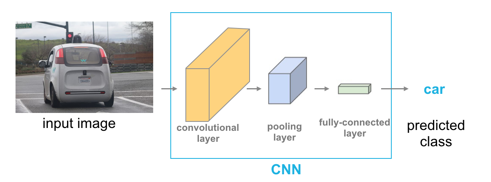

# Lesson 5: Convolutional Neural Networks

## Outline

// todo

## How Computers interpret images

// todo

## MLP Structure & Class Scores

// todo

## Loss & Optimization

// todo

### ReLu Activation Function

The purpose of an activation function is to scale the outputs of a layer so that they are a consistent, small value. Much like normalizing input values, this step ensures that our model trains efficiently!

A ReLu activation function stands for "rectified linear unit" and is one of the most commonly used activation functions for hidden layers. It is an activation function, simply defined as the positive part of the input, `x`. So, for an input image with any negative pixel values, this would turn all those values to `0`, black. You may hear this referred to as "clipping" the values to zero; meaning that is the lower bound.


### Cross-Entropy Loss

In the [PyTorch documentation](https://pytorch.org/docs/stable/nn.html#crossentropyloss) , you can see that the cross entropy loss function actually involves two steps:

* It first applies a softmax function to any output is sees
* Then applies [NLLLoss](https://pytorch.org/docs/stable/nn.html#nllloss); negative log likelihood loss

Then it returns the average loss over a batch of data. Since it applies a softmax function, we do not have to specify that in the `forward` function of our model definition, but we could do this another way.

#### Another approach

We could separate the softmax and NLLLoss steps.

* In the `forward` function of our model, we would explicitly apply a softmax activation function to the output, `x`.

```python
 ...
 ...
# a softmax layer to convert 10 outputs into a distribution of class probabilities
x = F.log_softmax(x, dim=1)

return x
```

* Then, when defining our loss criterion, we would apply NLLLoss

```python
# cross entropy loss combines softmax and nn.NLLLoss() in one single class
# here, we've separated them
criterion = nn.NLLLoss()
```

This separates the usual `criterion = nn.CrossEntropy()` into two steps: softmax and NLLLoss, and is a useful approach should you want the output of a model to be class probabilities rather than class scores.

## Defining a Network in Pytorch

#### 1. Import libraries

```python
# import libraries
import torch
import numpy as np
```

#### 2. Load and visualize data

```python
from torchvision import datasets
import torchvision.transforms as transforms

# number of subprocesses to use for data loading
num_workers = 0
# how many samples per batch to load
batch_size = 20

# convert data to torch.FloatTensor
transform = transforms.ToTensor()

# choose the training and test datasets
train_data = datasets.MNIST(root='data', train=True,
                                   download=True, transform=transform)
test_data = datasets.MNIST(root='data', train=False,
                                  download=True, transform=transform)

# prepare data loaders
train_loader = torch.utils.data.DataLoader(train_data, batch_size=batch_size,
    num_workers=num_workers)
test_loader = torch.utils.data.DataLoader(test_data, batch_size=batch_size, 
    num_workers=num_workers)
```

Visualizing a batch of Training Data

```python
import matplotlib.pyplot as plt
%matplotlib inline
    
# obtain one batch of training images
dataiter = iter(train_loader)
images, labels = dataiter.next()
images = images.numpy()

# plot the images in the batch, along with the corresponding labels
fig = plt.figure(figsize=(25, 4))
for idx in np.arange(20):
    ax = fig.add_subplot(2, 20/2, idx+1, xticks=[], yticks=[])
    ax.imshow(np.squeeze(images[idx]), cmap='gray')
    # print out the correct label for each image
    # .item() gets the value contained in a Tensor
    ax.set_title(str(labels[idx].item()))
```

View image in more detail

```python
img = np.squeeze(images[1])

fig = plt.figure(figsize = (12,12)) 
ax = fig.add_subplot(111)
ax.imshow(img, cmap='gray')
width, height = img.shape
thresh = img.max()/2.5
for x in range(width):
    for y in range(height):
        val = round(img[x][y],2) if img[x][y] !=0 else 0
        ax.annotate(str(val), xy=(y,x),
                    horizontalalignment='center',
                    verticalalignment='center',
                    color='white' if img[x][y]<thresh else 'black')
```


#### 3. Define Network Architecture

```python
import torch.nn as nn
import torch.nn.functional as F

## TODO: Define the NN architecture
class Net(nn.Module):
    def __init__(self):
        super(Net, self).__init__()
        # linear layer (784 -> 1 hidden node)
        self.fc1 = nn.Linear(28 * 28, 512)
        self.fc2 = nn.Linear(512, 512)
        self.fc3 = nn.Linear(512, 10)
        
        self.dropout = nn.Dropout(0.2)

    def forward(self, x):
        # flatten image input
        x = x.view(-1, 28 * 28)
        # add hidden layer, with relu activation function
        x = F.relu(self.fc1(x))
        x = self.dropout(x)
        x = F.relu(self.fc2(x))
        x = self.dropout(x)
        x = self.fc3(x)
        return x

# initialize the NN
model = Net()
print(model)
```

Model architecture

```
Net(
  (fc1): Linear(in_features=784, out_features=512, bias=True)
  (fc2): Linear(in_features=512, out_features=512, bias=True)
  (fc3): Linear(in_features=512, out_features=10, bias=True)
  (dropout): Dropout(p=0.2)
)
```

4. Specify Loss and Optimizer 

It's recommended that you use cross-entropy loss for classification. If you look at the documentation (linked above), you can see that PyTorch's cross entropy function applies a softmax funtion to the output layer *and* then calculates the log loss.

```python
# specify loss function
criterion = nn.CrossEntropyLoss()

# specify optimizer
optimizer = torch.optim.Adam(model.parameters())
```

5. Train Network

```python
# number of epochs to train the model
n_epochs = 50  # suggest training between 20-50 epochs

model.train() # prep model for training

for epoch in range(n_epochs):
    # monitor training loss
    train_loss = 0.0
    
    ###################
    # train the model #
    ###################
    for data, target in train_loader:
        # clear the gradients of all optimized variables
        optimizer.zero_grad()
        # forward pass: compute predicted outputs by passing inputs to the model
        output = model(data)
        # calculate the loss
        loss = criterion(output, target)
        # backward pass: compute gradient of the loss with respect to model parameters
        loss.backward()
        # perform a single optimization step (parameter update)
        optimizer.step()
        # update running training loss
        train_loss += loss.item()*data.size(0)
        
    # print training statistics 
    # calculate average loss over an epoch
    train_loss = train_loss/len(train_loader.dataset)

    print('Epoch: {} \tTraining Loss: {:.6f}'.format(
        epoch+1, 
        train_loss
        ))
```

6. Test the Trained Network

```python
# initialize lists to monitor test loss and accuracy
test_loss = 0.0
class_correct = list(0. for i in range(10))
class_total = list(0. for i in range(10))

model.eval() # prep model for *evaluation*

for data, target in test_loader:
    # forward pass: compute predicted outputs by passing inputs to the model
    output = model(data)
    # calculate the loss
    loss = criterion(output, target)
    # update test loss 
    test_loss += loss.item()*data.size(0)
    # convert output probabilities to predicted class
    _, pred = torch.max(output, 1)
    # compare predictions to true label
    correct = np.squeeze(pred.eq(target.data.view_as(pred)))
    # calculate test accuracy for each object class
    for i in range(batch_size):
        label = target.data[i]
        class_correct[label] += correct[i].item()
        class_total[label] += 1

# calculate and print avg test loss
test_loss = test_loss/len(test_loader.dataset)
print('Test Loss: {:.6f}\n'.format(test_loss))

for i in range(10):
    if class_total[i] > 0:
        print('Test Accuracy of %5s: %2d%% (%2d/%2d)' % (
            str(i), 100 * class_correct[i] / class_total[i],
            np.sum(class_correct[i]), np.sum(class_total[i])))
    else:
        print('Test Accuracy of %5s: N/A (no training examples)' % (classes[i]))

print('\nTest Accuracy (Overall): %2d%% (%2d/%2d)' % (
    100. * np.sum(class_correct) / np.sum(class_total),
    np.sum(class_correct), np.sum(class_total)))
```

## Image Classification Steps

Each time we have an image classification project the following steps are typically made:

1. Load and Visualize Data
2. Preprocess (Normalize, Transform)
3. Do a research to check if someone has already tackled this problem, and then define the Nerual Network model
4. Choose appropriate Loss & Optimization Algorithms for your model then `Train your model`
5. Save model after each check for Validation - Train diversion
6. Test model


## MLPs vs CNNs 

MLPs are good but have no idea about the structure of the input being classified, as they attempt to process an input representing the image as 1-D flattened vector.

CNN truely shines for real world problem, where messy data are the case.


MLPs | CNNs
-----|-----
Only use **_Fully Connected_** layes (huge number of parameters quickly fast incresing computational complexity) | Use Sparsely connected layers
Only accepts **_vectors as input_**| Accept Matrix as Input

> MLPs Flattening Example


### Local Connectivity

// todo importatn

### Filters and the Convolutional Neural Network

// todo

### Filters and Edges

// todo

### Frequency in Images

We have an intuition of what frequency means when it comes to sound. High-frequency is a high pitched noise, like a bird chirp or violin. And low frequency sounds are low pitch, like a deep voice or a bass drum. For sound, frequency actually refers to how fast a sound wave is oscillating; oscillations are usually measured in cycles/s (Hz), and high pitches and made by high-frequency waves. Examples of low and high-frequency sound waves are pictured below. On the y-axis is amplitude, which is a measure of sound pressure that corresponds to the perceived loudness of a sound and on the x-axis is time.


(Top image) a low frequency sound wave (bottom) a high frequency sound wave.

#### High and low frequency

Similarly, frequency in images is a **rate of change**. But, what does it means for an image to change? Well, images change in space, and a high frequency image is one where the intensity changes a lot. And the level of brightness changes quickly from one pixel to the next. A low frequency image may be one that is relatively uniform in brightness or changes very slowly. This is easiest to see in an example.


Most images have both high-frequency and low-frequency components. In the image above, on the scarf and striped shirt, we have a high-frequency image pattern; this part changes very rapidly from one brightness to another. Higher up in this same image, we see parts of the sky and background that change very gradually, which is considered a smooth, low-frequency pattern.

High-frequency components also correspond to the edges of objects in images, which can help us classify those objects.

### Filters and OpenCV 

// todo


### Convolutional Layer

#### The Importance of Filters

What you've just learned about different types of filters will be really important as you progress through this course, especially when you get to Convolutional Neural Networks (CNNs). CNNs are a kind of deep learning model that can learn to do things like image classification and object recognition. They keep track of spatial information and learn to extract features like the edges of objects in something called a convolutional layer. Below you'll see an simple CNN structure, made of multiple layers, below, including this "convolutional layer".



#### Convolutional Layer

The convolutional layer is produced by applying a series of many different image filters, also known as convolutional kernels, to an input image.


In the example shown, 4 different filters produce 4 differently filtered output images. When we stack these images, we form a complete convolutional layer with a depth of 4!

#### Learning

In the code you've been working with, you've been setting the values of filter weights explicitly, but neural networks will actually learn the best filter weights as they train on a set of image data. You'll learn all about this type of neural network later in this section, but know that high-pass and low-pass filters are what define the behavior of a network like this, and you know how to code those from scratch!

In practice, you'll also find that many neural networks learn to detect the edges of images because the edges of object contain valuable information about the shape of an object.


#### Strides

One of the hyperparameters of a CNN is referred to as the _stride_ which is the amount for which the convolution window slide across the image 


#### Padding

// todo